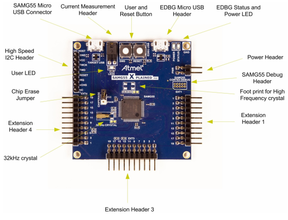

.. _samg55_xplained_pro:

SAMG55 Xplained Pro
################

Overview
********

The SAMG55 Xplained Pro evaluation kit is a development platform to evaluate the
Microchip (Atmel) SAMG5x series microcontrollers.

Hardware
********

- ATSAMG55J19 ARM Cortex-M4 Processor
- 12 MHz crystal oscillator
- internal 32.768 kHz crystal oscillator
- 3 Xplained Pro extension headers
- Micro-AB USB device
- Micro-AB USB debug interface supporting CMSIS-DAP, Virtual COM Port and Data
  Gateway Interface (DGI)
- One reset and one user pushbutton
- 1 yellow user LED

Supported Features
==================

The samg55_xplained_pro board configuration supports the following hardware
features:

+-----------+------------+-------------------------------------+
| Interface | Controller | Driver/Component                    |
+===========+============+=====================================+
| NVIC      | on-chip    | nested vector interrupt controller  |
+-----------+------------+-------------------------------------+
| SYSTICK   | on-chip    | systick                             |
+-----------+------------+-------------------------------------+
| UART      | on-chip    | serial port                         |
+-----------+------------+-------------------------------------+

Other hardware features are not currently supported by Zephyr.

The default configuration can be found in the Kconfig
:file:`boards/arm/samg55_xplained_pro/samg55_xplained_pro_defconfig`.

Connections and IOs
===================

The `SAMG55 Xplained Pro Online User Guide`_ has detailed information about board
connections. Download the `SAMG55 Xplained Schematic`_ for more detail.

System Clock
============

The SAMG55 MCU is configured to use the 12 MHz internal oscillator on the board
with the on-chip PLL to generate an 84 MHz system clock.

Serial Port
===========

The ATSAMG55J19 MCU has 2 UARTs and 2 USARTs. One of the USARTs is
configured for the console and is available as a Virtual COM Port via EDBG USB
chip.

Programming and Debugging
*************************

The SAM4S Xplained Pro board comes with EDBG. This provides a debug interface to the 
SAMG55 chip. 

Flashing
========

#. Build the Zephyr kernel and the :ref:`hello_world` sample application:

   .. code-block:: console

      $ cd $ZEPHYR_BASE/samples/hello_world/
      $ make BOARD=samg55_xplained_pro

#. Connect the SAMG55 Xplained Pro board to your host computer using the USB debug
   port. Then, enter the following command:

   .. code-block:: console

      $ make BOARD=samg55_xplained_pro flash

#. Run your favorite terminal program to listen for output. Under Linux the
   terminal should be :code:`/dev/ttyACM0`. For example:

   .. code-block:: console

      $ minicom -D /dev/ttyACM0 -o

   The -o option tells minicom not to send the modem initialization
   string. Connection should be configured as follows:

   - Speed: 115200
   - Data: 8 bits
   - Parity: None
   - Stop bits: 1

   You should see "Hello World! arm" in your terminal.

Debugging
========
#. Access gdb with the following make command:

   .. code-block:: console

      $ make BOARD=samg55_xplained_pro debug

References
**********

.. target-notes::

.. _SAM4S Xplained Pro Online User Guide:
    http://www.atmel.com/webdoc/sam4sxplainedpro/index.html

.. _SAM4S Xplained Pro Schematic:
    http://www.atmel.com/tools/atsam4s-xpro.aspx?tab=documents
